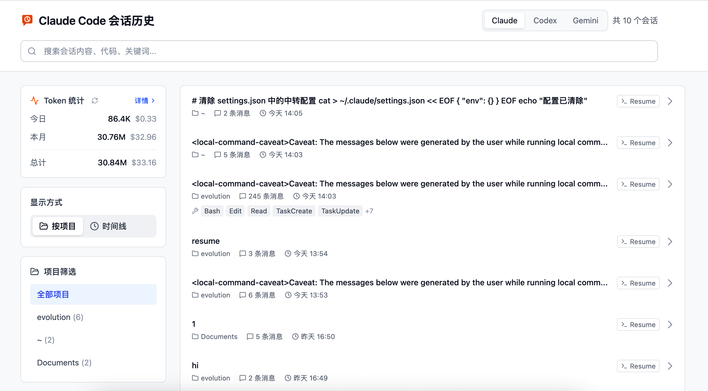
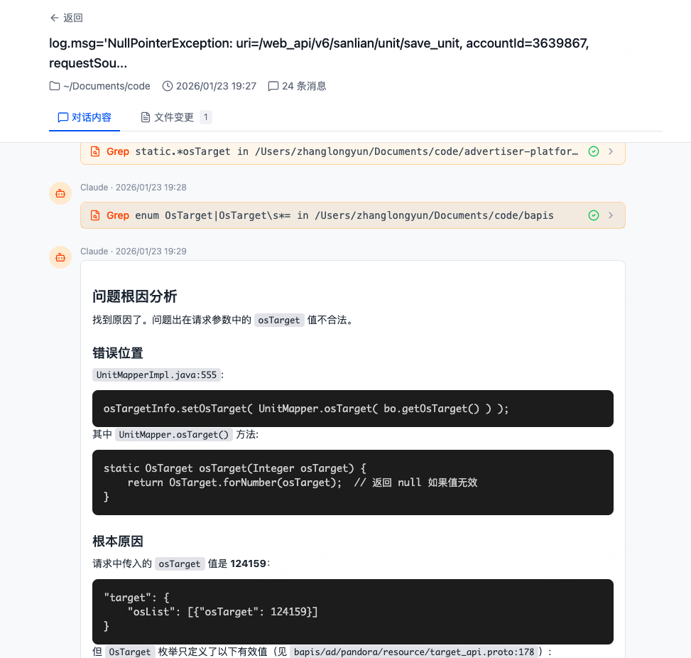
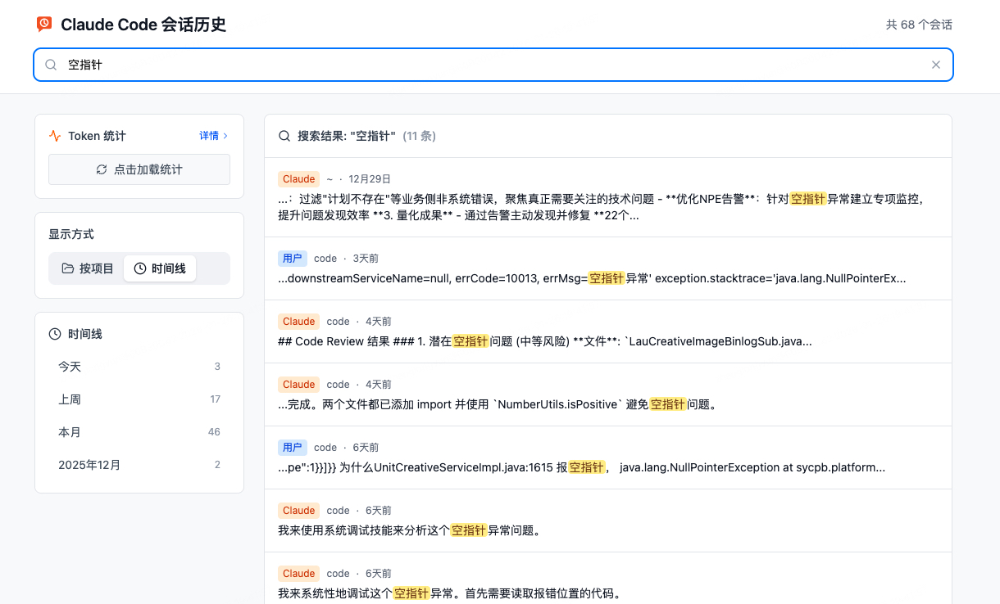
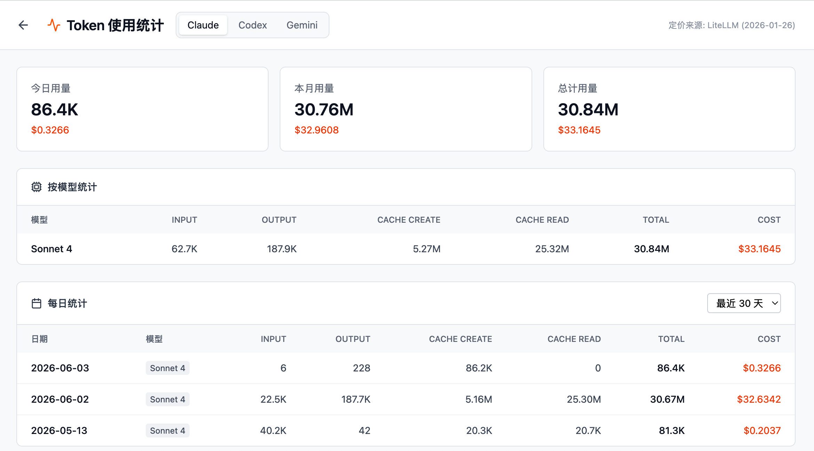

# Claude Session Viewer

一个用于浏览和搜索 Claude Code、Codex CLI、Gemini CLI 历史会话的 Web 可视化工具。



## 功能特性

- **多来源会话浏览** - 支持在 Claude / Codex / Gemini 之间切换，分别查看本地历史会话
- **时间线模式** - 跨项目按时间倒序浏览所有会话，支持日期分组导航
- **项目筛选** - 按工作目录筛选会话
- **全文搜索** - 搜索会话中的关键词、代码片段，结果高亮显示
- **会话详情** - 查看完整对话内容，支持 Markdown 渲染
- **工具调用可视化** - 优化的工具调用展示
  - Edit 工具：Git Diff 风格对比
  - Read/Write 工具：代码高亮 + 行号
  - Task 工具：Markdown 渲染
  - Glob/Grep：文件列表展示
  - WebFetch/WebSearch：URL 预览 + 结果展示
- **文件变更追踪** - 查看每个会话修改了哪些文件
- **一键复制** - Claude 回复支持一键复制
- **Resume 辅助** - 会话列表和详情页支持一键复制 `claude --resume {session_id}` 命令
- **上下文复制** - 会话详情页支持复制压缩后的历史上下文，用于继续对话或迁移到新会话
- **Token 用量统计** - 类似 ccusage 的 Token 消耗统计
  - 支持 Claude / Codex / Gemini 来源切换
  - 首页侧边栏摘要：今日、本月、总计用量及费用
  - 详情页：按日期统计、按模型统计
  - 支持手动刷新，10 分钟缓存
  - Claude 支持 200K 分层定价
  - Codex 支持 OpenAI Codex 模型定价

## 技术栈

### 后端
- Python 3.10+
- FastAPI
- Pydantic

### 前端
- React 19 + TypeScript
- Tailwind CSS
- Vite
- react-markdown

## 快速开始

### 方式一：一键启动（推荐）

```bash
# 克隆后进入项目
cd claude-session-viewer

# 一键启动（自动安装依赖、启动前后端、打开浏览器）
./start.sh
```

### 方式二：手动启动

#### 1. 启动后端

```bash
cd backend

# 创建虚拟环境并安装依赖
python3 -m venv .venv
source .venv/bin/activate
pip install -r requirements.txt

# 启动服务
uvicorn main:app --port 8000 --reload
```

#### 2. 启动前端

```bash
cd frontend

# 安装依赖
npm install

# 启动开发服务器
npm run dev
```

#### 3. 访问应用

打开浏览器访问 http://localhost:5173

## 项目结构

```
claude-session-viewer/
├── backend/
│   ├── main.py              # FastAPI 入口
│   ├── session_service.py   # Claude/Codex/Gemini 会话来源聚合
│   ├── parser.py            # Claude Code JSONL 解析器
│   ├── codex_parser.py      # Codex CLI JSONL 解析器
│   ├── gemini_parser.py     # Gemini CLI 会话解析器
│   ├── compressor.py        # 会话上下文压缩
│   ├── models.py            # Pydantic 数据模型
│   └── requirements.txt     # Python 依赖
├── frontend/
│   ├── src/
│   │   ├── components/      # React 组件
│   │   │   ├── MessageBubble.tsx   # 消息气泡（含工具渲染）
│   │   │   ├── DiffViewer.tsx      # Git Diff 视图
│   │   │   ├── CodeViewer.tsx      # 代码查看器
│   │   │   ├── TimelineView.tsx    # 时间线视图
│   │   │   ├── ResumeButton.tsx    # Resume 命令复制
│   │   │   ├── CopyContextButton.tsx # 压缩上下文复制
│   │   │   ├── UsageStats.tsx      # Token 用量统计
│   │   │   └── ...
│   │   ├── pages/           # 页面组件
│   │   │   ├── Home.tsx            # 首页
│   │   │   ├── Session.tsx         # 会话详情页
│   │   │   ├── Usage.tsx           # Token 用量详情页
│   │   │   └── ...
│   │   └── lib/             # 工具函数和 API
│   └── package.json
├── start.sh                 # 一键启动脚本
├── stop.sh                  # 停止脚本
└── README.md
```

## 数据来源

本工具读取本机 CLI 工具的本地存储数据（只读，不会修改任何数据）。

### Claude Code

```
~/.claude/
├── projects/           # 会话数据（JSONL 格式）
│   └── {project}/
│       └── {uuid}.jsonl
└── file-history/       # 文件变更备份
    └── {session}/
        └── {hash}@v{n}
```

### Codex CLI

```
~/.codex/
└── sessions/           # 会话数据（JSONL 格式）
    └── **/*.jsonl
```

### Gemini CLI

```
~/.gemini/
└── tmp/
    └── **/chats/session-*.json
```

## Token 费用计算

从会话文件中提取模型和 token usage 字段进行统计，并按来源分别计算：

- Claude：从 `assistant` 消息的 `usage` 字段统计 input/output/cache tokens
- Codex：从 Codex 会话记录中的 token usage 统计 input/output/cache read，并按 Codex 模型定价估算费用
- Gemini：从 Gemini 会话记录中提取可用 token usage 信息进行统计

```json
{
  "message": {
    "model": "claude-opus-4-5-20251101",
    "usage": {
      "input_tokens": 10000,
      "output_tokens": 500,
      "cache_creation_input_tokens": 18627,
      "cache_read_input_tokens": 50000
    }
  }
}
```

### 定价表（每百万 tokens）

> Claude 数据来源: [LiteLLM Model Pricing](https://github.com/BerriAI/litellm/blob/main/model_prices_and_context_window.json)
>
> Codex 数据来源: [OpenAI Pricing](https://openai.com/api/pricing/)
>
> Gemini 数据来源: 本地会话中记录的模型与 token usage

## 截图

### 多来源会话列表


### 会话详情


### 搜索功能


### Token 用量统计


## 开发计划

- [ ] AI 生成会话摘要
- [ ] 导出为 Markdown
- [ ] 会话标签管理
- [ ] 为 Codex / Gemini 提供更精确的原生命令 Resume 支持
